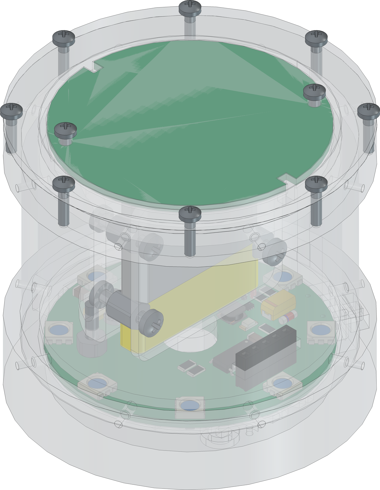
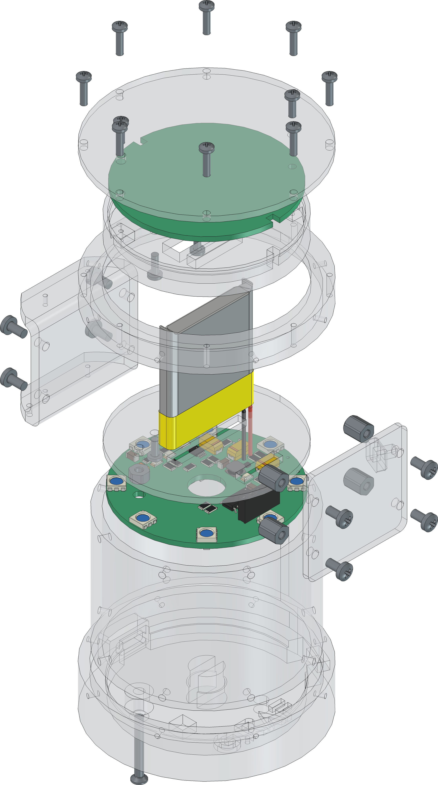

  

# `RCL` - RGB Color Lamp

The `RCL` is a board with a set of [APA102](#additional-information) or any other `SPI` controllable `RGB-LED`. The board itself is driven with `5V` over USB and can be configured with the integrated UART interface ([MCP2221A](#additional-information)). The `Color Lamp` itself is controlled over the additional `Touchpad` ([TPD](https://github.com/0x007e/tpd/)) and can be switched on/off over a slide switch.

| Experience  | Level                                                                               |
|:------------|:-----------------------------------------------------------------------------------:|
| Soldering   |  |

# Downloads

| Type      | File                                                                                                                                                 | Description     |
|:---------:|:----------------------------------------------------------------------------------------------------------------------------------------------------:|:----------------|
| Schematic | [pdf](https://github.com/0x007E/rcl/releases/latest/download/schematic.pdf) / [cadlab](https://cadlab.io/project/30341/main/files)                   | Schematic files |
| Board     | [pdf](https://github.com/0x007E/rcl/releases/latest/download/pcb.pdf) / [cadlab](https://cadlab.io/project/30341/main/files)                         | Board file      |
| Drill     | [pdf](https://github.com/0x007E/rcl/releases/latest/download/drill.pdf)                                                                              | Drill file      |
| PCB       | [zip](https://github.com/0x007E/rcl/releases/latest/download/kicad.zip) / [tar](https://github.com/0x007E/rcl/releases/latest/download/kicad.tar.gz) | KiCAD/Gerber/BoM/Drill files |
| Mechanical | [zip](https://github.com/0x007E/rcl/releases/latest/download/freecad.zip) / [tar](https://github.com/0x007E/rcl/releases/latest/download/freecad.tar.gz) | FreeCAD/Housing and exported step/stl files |

# Hardware

The pcb is created with `KiCAD`, the housing with `FreeCAD`. All files are built with `github actions` so that they are ready for a production environment.

## PCB

The circuit board is populated on both sides (Top, Bottom). The best way for soldering the `SMD` components is within a vapor phase soldering system and for the `THT` components with a standard soldering system.

### Top Layer

### Bottom Layer

## Mechanical

The housing has a tolerance of `0.2mm` on each side of the case. So the pcb should fit perfectly in the housing. The tolerance can be modified with `FreeCAD` in the `Parameter` Spreadsheet.

### Assembled

### Exploded

# Additional Information

| Type       | Link                                                                                                      | Description                                        |
|:----------:|:---------------------------------------------------------------------------------------------------------:|:---------------------------------------------------|
| APA102     | [pdf](https://cdn.sparkfun.com/datasheets/Components/LED/APA102C.pdf)                                     | RGB Full Color LED                                 |
| T3A33BRG   | [pdf](https://mm.digikey.com/Volume0/opasdata/d220001/medias/docus/6794/3147_T3A33BRG-H9C0002X1U1930.pdf) | Harvatek Surface Mount PLCC IC+RGB LEDs Data Sheet |
| MCP2221A   | [pdf](https://ww1.microchip.com/downloads/en/devicedoc/20005565b.pdf)                                     | USB 2.0 to I2C/UART Protocol Converter with GPIO   |

---

R. GAECHTER
